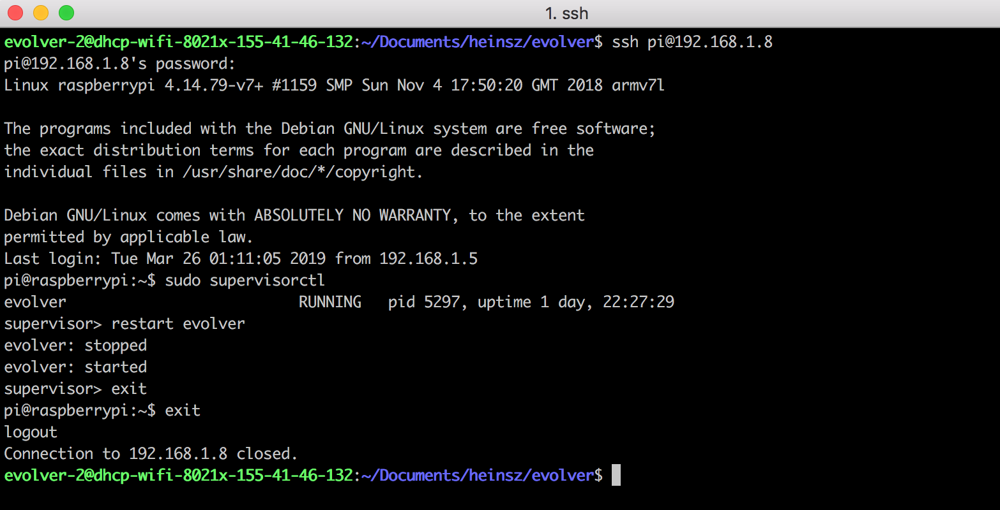

# Updating the eVOLVER Server

If you have any questions or concerns not addressed here, reach out on [this forum post](https://www.evolver.bio/t/updating-the-evolver-server/69).


You can download the latest version of the code on our [GitHub release page](https://github.com/FYNCH-BIO/evolver/releases). If you do, skip step 3 below.


#### [Mac/UNIX](updating-the-evolver-server.md#mac-unix)

#### [Windows](updating-the-evolver-server.md#undefined)

### Mac/Unix

1. Open up a terminal of your choice (I use [iTerm2](https://iterm2.com/)).
2. Use the `cd` command to navigate to the eVOLVER server software.

3\. Use `git` to pull the latest version of the code. I have my own fork, so I need to pull the code from an upstream master branch. `git pull origin master` should work for most setups.

4\. I like to use the  `scp` command to transfer the files over to the eVOLVER. `scp` stands for secure copy - it uses`ssh` to transfer files between computers on a network. You can also use any GUI based tool - [Filezilla](https://filezilla-project.org/) is a popular one. I also normally only transfer the python files, and not the entire evolver directory. The server saves calibration files and other configurations which we don't want to modify by accident. To transfer only the relevant python files, run the following command:


Replace the \<eVOLVER\_IP> text below with the actual eVOLVER IP.


`scp evolver/*.py pi@<eVOLVER_IP>:evolver/evolver`

5\. Now that the files have been updated, the last step is to restart the server so the changes will take effect. `ssh` over to the evolver and run `sudo supervisorctl`. Then enter `restart evolver`, and you're done!

### Windows

Follow steps 1-3 as described above.

4\. Use [WinSCP](https://winscp.net/eng/index.php) or [Filezilla](https://filezilla-project.org/) to drag the .py files into the correct locations. Be careful not to overwrite other types of files.

5\. Most Windows 10 computers have a Windows 10 SSH client (such as OpenSSH Client) so you can log into the Raspberry Pi from Command Prompt in order to restart the server. Simply type `ssh pi@<eVOLVER_IP>` (replace \<eVOLVER\_IP> with your actual eVOLVER IP) and log in. From here you can run `sudo supervisorctl` as normal.
