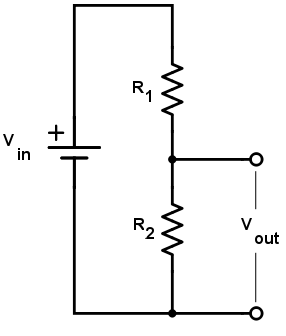

# Motherboard Layout and Circuitry

## General Information

As a quick recap, the Motherboard is designed to collect and send data/power to all 16 Smart Sleeves. The Motherboard is essentially a large PCB used to route signals via a network of electrical traces. Each SA slot (8 total) posses two electrical connections (positive and negative leads) to each Smart Sleeve CMB (8\*2=16 connections per CMB). These two leads per SA slot are then used to make the physical connections to a sensor/actuator. In total, this results in **2** (leads per sensor/actuator) **\* 8** (SA slots) **\* 16** (number of Smart Sleeves) **= 256 total traces.** This is important to keep in mind when modifying the Smart Sleeve or troubleshooting when problems arise.

Lastly, each SA slot acts as a de-multiplexer/multiplexer for bidirectional relay of signals with its cognate SAMD21 Arduino.&#x20;

TODO: Include a figure to highight transfer of data including voltage divider

## Tuning Sensor Behavior

As mentioned earlier, the Motherboard makes use of voltage divider circuits to acquire sensory data on cultures. By connecting a two resistors in series with a Vin, a voltage source we can produce Vout, a set fraction of Vin (Fig 1.). The value of Vout is based on the the resitance values of the two resitors and the value of Vin, which can be modeled as:

$$
Vout = Vin *R1/(R1+R2)
$$

This principle is used by the Motherboard to implement sensory circuits that leverage variable resistor elements, which produce varying resistance levels in response to environmental parameters (i.e. thermistors, photodiode, etc). By placing a variable resistor at R2, we can acquire a Vout that is proportional to the resistance R2 is producing, which in turn should be proportional to some environmental condition (i.e. heat).&#x20;

Based on experimental conditions, it may be of interest to tune how these sensory circuits behave to acquire optimal data. The Motherboard offers two primary ways to modify sensory circuits: 1) swap R1 to alter sensor sensitivity and 2) swap Vin to alter the circuit's dynamic range.

### Tuning Sensor Sensitivity

To streamline sensitivity tuning, the Motherboard uses 9-pin resistor packs (one is reserved for ground), which connect to the left-and-right to each SA slots (8\*2=16 parallel resistors). As a user, all you need to do is remove the two current resistor packs and replace them with packs with desired resitance values. By taking a look at the raw sensory data coming off the eVOLVER, you can assess if the sensitivity modifications are adequate or not.&#x20;


Resitor packs are polarized electrical components so ensure that the ground pin (with dot) is properly put into the female ground connector on the Motherboard.



Avoid bending or breaking pins when removing/placing resistor packs. Use pliers to gently pull up on both ends to nudge the resistor pack out&#x20;

